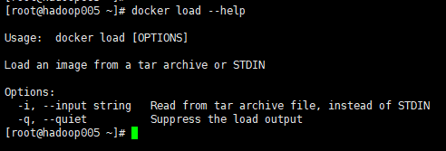
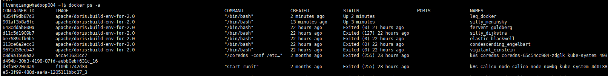
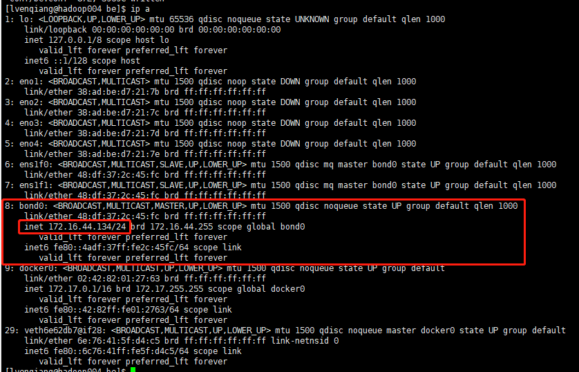

[TOC]
## 零碎知识点
### 1 docker
[docker 镜像网址 ](https://hub.docker.com/)

#### 1.1 docker镜像拉取
```bash
docker pull apache/doris:build-env-for-2.0
```

#### 1.1 docker 镜像导出和导入

##### 1.1.1 docker 镜像导出
**save**命令
- <font color=red>docker save [options] images [images...]</font>
  
- 示例(doris)
```bash
docker save -o doris_build_v2.0.tar apache/doris:build-env-for-2.0
```

##### 1.1.1 docker 镜像导入
**load**命令
- <font color=red>docker load [options] images [images...]</font>
  
- 示例(doris)
```bash
docker load -i doris_build_v2.0.tar
```
参考连接：https://blog.csdn.net/ncdx111/article/details/79878098

#### 1.2 docker镜像环境使用
##### 1.2.1 使用docker报错
```bash
[lvenqiang@hadoop004 dev_branch]$ docker run -it apache/doris:build-env-for-2.0
docker: Got permission denied while trying to connect to the Docker daemon socket at unix:///var/run/docker.sock: Post http://%2Fvar%2Frun%2Fdocker.sock/v1.38/containers/create: dial unix /var/run/docker.sock: connect: permission denied.
See 'docker run --help'

# 将当前用户添加进docker组，root用户操作
# 添加用户组
[root@hadoop004 dev_branch]# groupadd docker
# 将当前用户添加至用户组
[root@hadoop004 dev_branch]# gpasswd -a lvenqiang docker
# 更新用户组
[root@hadoop004 dev_branch]# newgrp docker
```
重新登录自己用户即可

##### 1.2.2 启动docker
挂载本地磁盘的方式启动
```bash
# 44.134环境
docker run --name leq_docker -v /data3/lvenqiang/dev_branch:/data3/lvenqiang/dev_branch -itd apache/doris:build-env-for-2.0 /bin/bash

# 48.9环境
docker run --name leq_docker -v /data8/leq/doris:/root/dev_branch -itd apache/doris:build-env-for-2.0 /bin/bash

# 48.6环境
docker run --name leq_docker -v /mnt/ssd/leq/doris:/root/dev_branch -itd apache/doris:build-env-ldb-toolchain-latest /bin/bash

# 48.6环境
docker run --name leq_docker -v /mnt/ssd/leq/doris:/root/dev_branch -itd apache/doris:build-env-for-2.0 /bin/bash
```
参数说明
|参数|作用|
|---|---|
|-i|交互式操作|
|-t|终端|
|-v|挂载本地磁盘的方式<br>(均为全路径)|
|-d|后台启动|

##### 1.2.3 查看所有运行过的docker
```bash
docker ps -a
```


##### 1.2.4 进入容器
```bash
docker exec -it docker_id(or name) /bin/bash
```
- exec 与 attach的区别
  exec exit后不会导致容器退出，attach exit后会导致容器退出

##### 1.2.5 根据容器id、name操作容器
```bash
# 重启容器
docker restart docker_id
# 启动一个被停止的容器
docker start docker_id
# 停止容器
docker stop docker_id
# 删除容器
docker rm -f docker_id
```
### 2 yum

#### 2.1 安装git
```bash
yum install -y git
```
发现git版本太低

#### 2.2 更新yum源
yum源配置在/etc/yum.repos.d, 更新该目录下的文件，一定要先备份
```bash
# 进入目录
cd /etc/yum.repos.d

# 创建备份目录并备份数据
mkdir bak_20231208
cp CentOS-7.repo CentOS-Media.repo redhat.repo bak_20231208

# 拷贝新的yum源(42节点)
scp CentOS-7.repo CentOS-Media.repo redhat.repo root@127.16.44.131:/etc/yum.repos.d

# 清理缓存(测试发现不执行该步骤并不影响升级)
yum clean all

# 升级git
yum install -y git

# git --version，可以看到版本已经升级
```
#### 3 doris 部署
##### 3.1 部署fe
绑定ip
因为有多网卡的存在，或因为安装过 docker 等环境导致的虚拟网卡的存在，同一个主机可能存在多个不同的 ip。当前 Doris 并不能自动识别可用 IP。所以当遇到部署主机上有多个 IP 时，必须通过 priority_networks 配置项来强制指定正确的 IP。

priority_networks 是 FE 和 BE 都有的一个配置，配置项需写在 fe.conf 和 be.conf 中。该配置项用于在 FE 或 BE 启动时，告诉进程应该绑定哪个IP。示例如下：

priority_networks=10.1.3.0/24

这是一种 CIDR 的表示方法。FE 或 BE 会根据这个配置项来寻找匹配的IP，作为自己的 localIP。
- 查看cidr表示法的ip

- 启动
```bash
bin/start_fe.sh --daemon
```
#### 3.2 部署be
- 查看JAVA_HOME
```bash
java -XshowSettings:properties -version
```
将JAVA_HOME设置到conf/be.conf
- 在 FE 中添加所有 BE 节点
BE 节点需要先在 FE 中添加，才可加入集群。可以使用 mysql-client(下载MySQL 5.7) 连接到FE：
```bash
./mysql-client -h fe_host -P query_port -uroot
```
其中 fe_host 为 FE 所在节点 ip；query_port 在 fe/conf/fe.conf 中的；默认使用 root 账户，无密码登录。
登录后，执行以下命令来添加每一个 BE：
```sql
ALTER SYSTEM ADD BACKEND "be_host:heartbeat-service_port";
```
其中 be_host 为 BE 所在节点 ip；heartbeat_service_port 在 be/conf/be.conf 中。