# Prometheus+Grafana监控MySQL
- Prometheus(由go语言(golang)开发)是一套开源的监控&报警&时间序列数据库的组合。适合监控docker容器。因为kubernetes(俗称k8s)的流行带动了prometheus的发展。被很多人称为下一代监控系统。
- Grafana是一个开源的图表可视化系统，简单说图表配置比较方便、生成的图表比较漂亮，并能实现报警。支持五十多种数据源，Prometheus就是其中支持的一种。
- 下面就介绍了利用Prometheus与Grafana对Mysql服务器性能监控的方法。
## 1 架构图
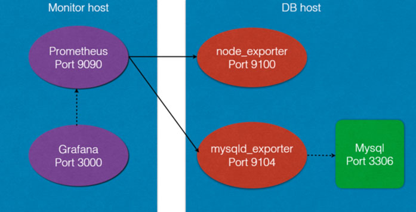
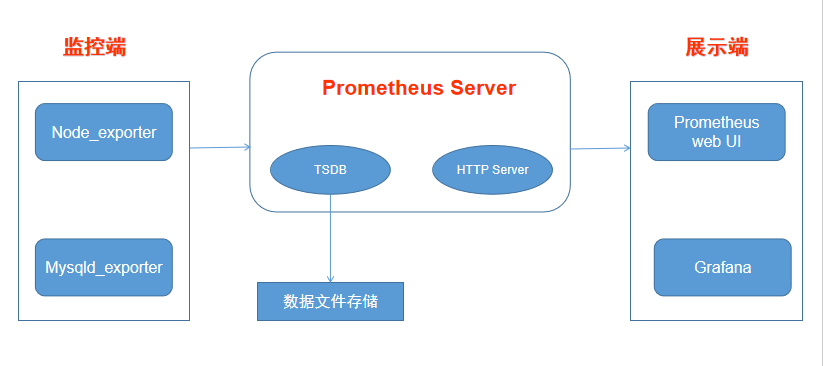

## 2 环境准备
- grafana服务器：172.16.48.9
- Prometheus服务器：172.16.48.9
- 被监控服务器：172.16.26.34

## 3 安装Prometheus
从 https://prometheus.io/download/ 下载相应版本，安装到服务器上
官网提供的是二进制版，解压就能用，不需要编译

### 3.1 安装
```bash
# 解压安装包
tar -xvf prometheus-2.48.0-rc.1.linux-amd64.tar.gz

# 创建start.sh 使用默认配置文件
nohup ./prometheus --config.file=./prometheus.yml 2>&1 &

# 启动
./start.sh

# 确认是否正常启动（默认端口9090）
[root@dn4 prometheus-2.48.0-rc.1.linux-amd64]# netstat -lnptu | grep 9090
tcp6       0      0 :::9090                 :     103006/prometheus 
```

### 3.2 prometheus界面
通过浏览器访问http://服务器IP:9090就可以访问到prometheus的主界面
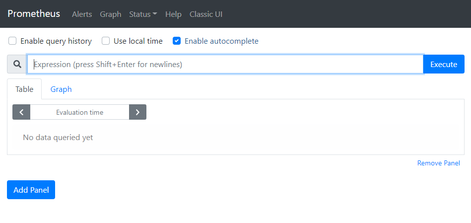

点Status-->Targets-->就可以看到监控的本机
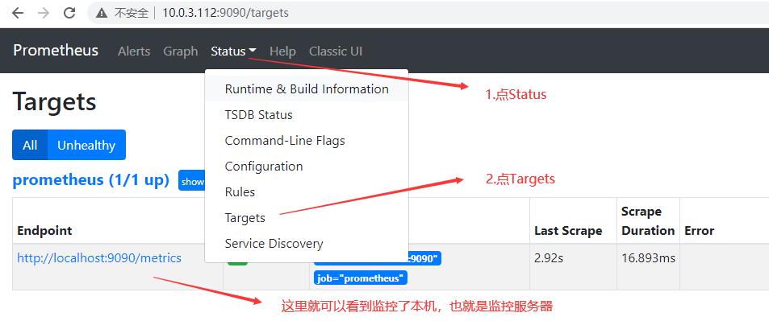

## 4 监控远程Linux主机

### 4.1 在被监控端上安装node_exporter组件
下载地址: https://prometheus.io/download/
```bash
# 解压安装包
tar -xvf node_exporter-1.6.1.linux-amd64.tar.gz

# 使用nohup后台运行
nohup /opt/node_exporter/node_exporter &

# 确认是否正常启动（默认端口9100）
[root@mysql01 ~]# netstat -lnptu | grep 9100
tcp6       0      0 :::9100                 :::*                    LISTEN      20716/node_exporter 

扩展: nohup命令: 如果把启动node_exporter的终端给关闭,那么进程也会
随之关闭。nohup命令会帮你解决这个问题。
```

### 4.2 4.2 通过浏览器访问http://被监控端IP:9100/metrics 就可以查看到node_exporter在被监控端收集的监控信息
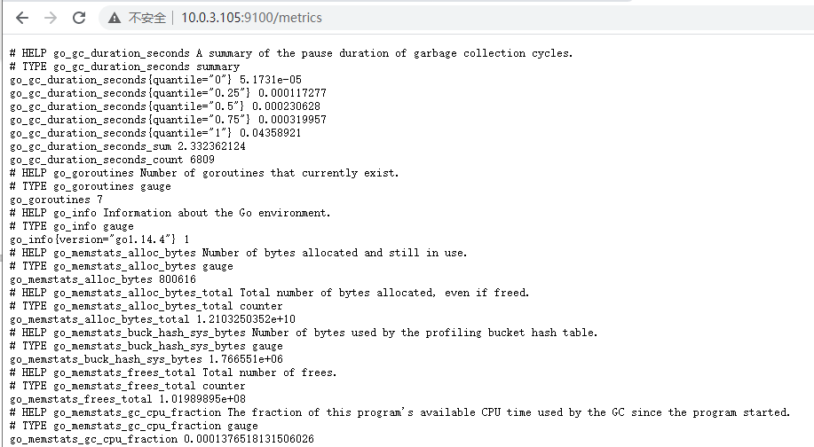

### 4.3 回到prometheus服务器的配置文件里添加被监控机器的配置段
```yaml
- job_name: "node_resource"
    static_configs:
        - targets: ["172.16.26.34:9100"]
```
改完配置文件后，重启服务
```bash
[root@server ~]# pkill prometheus 

# 启动
./start.sh
```

###4.4 回到web管理界面，可以看到多了两台监控主机
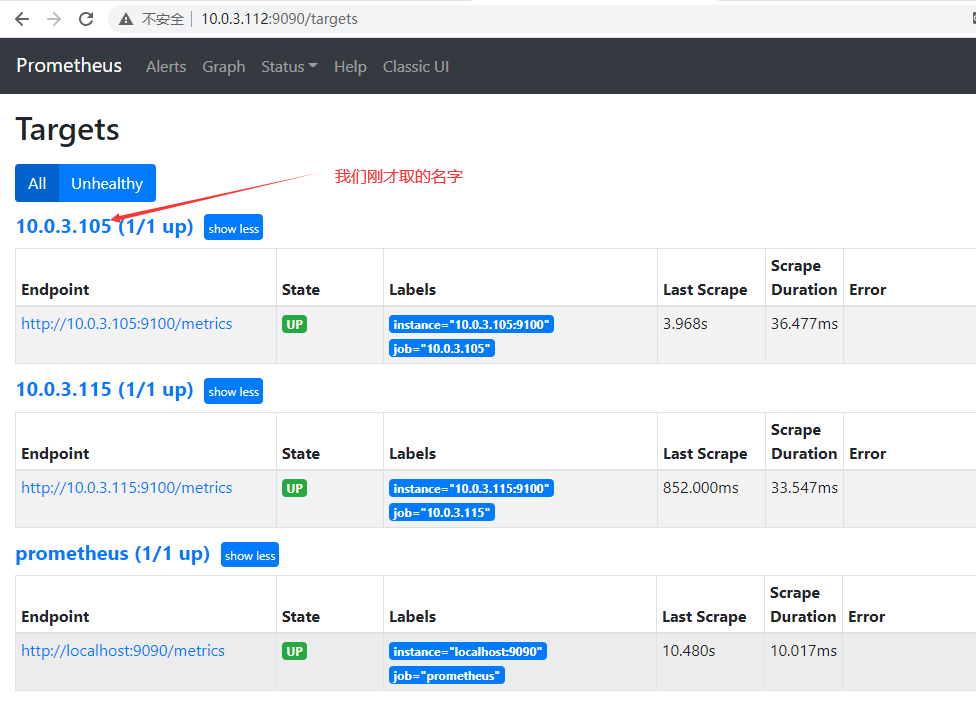

## 5 监控远程MySQL

### 5.1 在被管理MySQL服务器上安装mysqld_exporter组件
下载地址: https://prometheus.io/download/

```bash
# 解压安装包
tar -xf mysqld_exporter-0.15.0.linux-amd64.tar.gz

# 在MySQL服务器上创建监控用户
mysql> grant select,replication client, process on *.* to 'mysql_monitor'@'localhost' identified by '123';
Query OK, 0 rows affected, 1 warning (0.00 sec)

mysql> flush privileges;
Query OK, 0 rows affected (0.03 sec)

mysql> exit
Bye

# 将上面创建的mysql用户信息写入mysqld_exporter配置文件（新创建一个）
[root@mysql01 ~]# vim ~/mysqld_exporter/.my.cnf
[client]
host=127.0.0.1
port=31035
user=mysql_monitor
password=123

# 启动mysqld_exporter
nohup ~/mysqld_exporter/mysqld_exporter --config.my-cnf=~/mysqld_exporter/.my.cnf &

# 确认是否正常启动（默认端口9104）
[root@mysql01 ~]# netstat -lnptu | grep 9104
tcp6       0      0 :::9104                 :::*                    LISTEN      32688/mysqld_export 

```

## 5.2 回到prometheus服务器的配置文件里添加被监控的mariadb的配置段
```yaml
在主配置文件最后面添加被监控主机信息
[root@server ~]# vim /opt/prometheus/prometheus.yml 

- job_name: "mysql_resource"
    static_configs:
      - targets: ["172.16.26.34:9104"]
```
改完配置文件后，重启服务
```bash
[root@server ~]# pkill prometheus 

# 启动
./start.sh
```

### 5.3 回到web管理界面点Status-->Targets-->就可以看到监控的MySQL服务器了
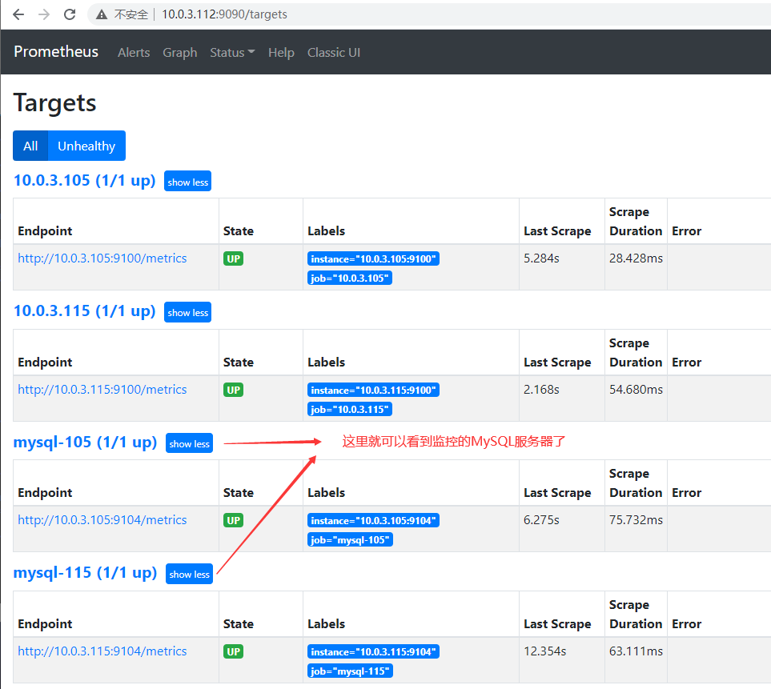
回到主界面搜索mysql相关参数
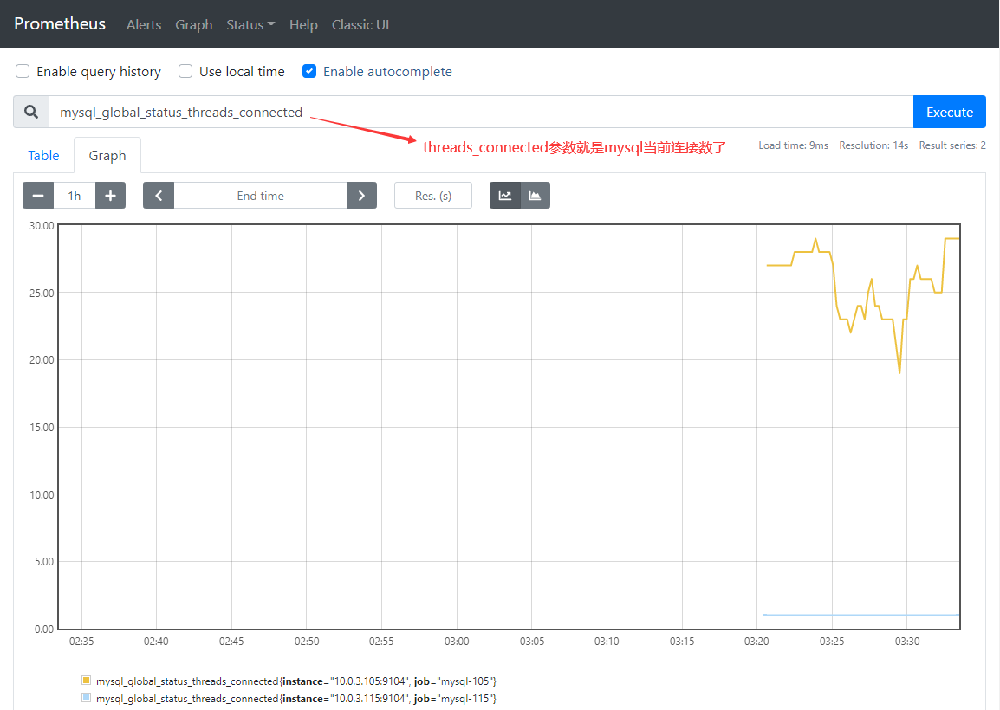


## 6 Grafana可视化图形工具

### 6.1 什么是Grafana
开头已经讲过了，官网：[grafana 官网](https://grafana.com/)
下载地址:https://grafana.com/grafana/download
```bash
# 解压软件包
tar xvf grafana-enterprise-10.2.0.linux-amd64.tar.gz

# 启动grafana
nohup ./bin/grafana 2>&1 &

# 检查端口
[root@dn4 bin]# netstat -lnptu | grep 3000
tcp6       0      0 :::3000                 :::*                    LISTEN  
```

### 6.3 登陆grafana WEB界面
通过浏览器访问 http:// grafana服务器IP:3000就到了登录界面,使用默认用户名admin，密码admin
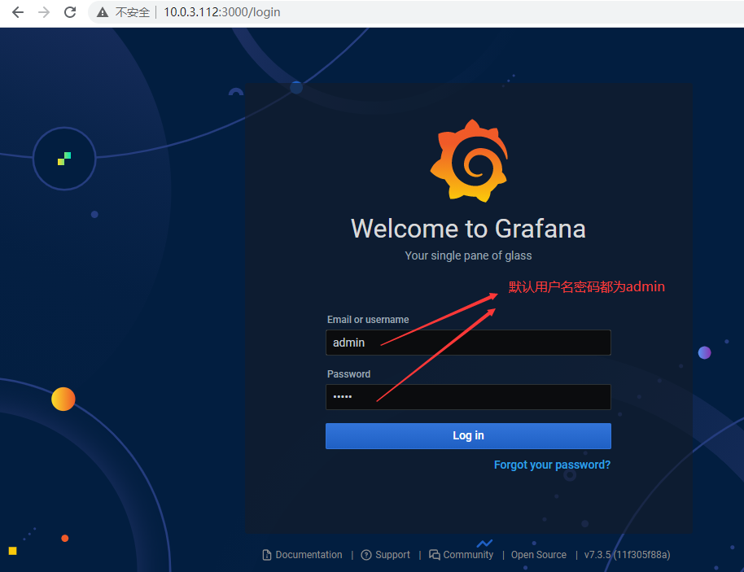
- 登陆后会提示你修改密码，暂时不想修改话可以先跳过

至此，我们就可以看到grafana主界面了
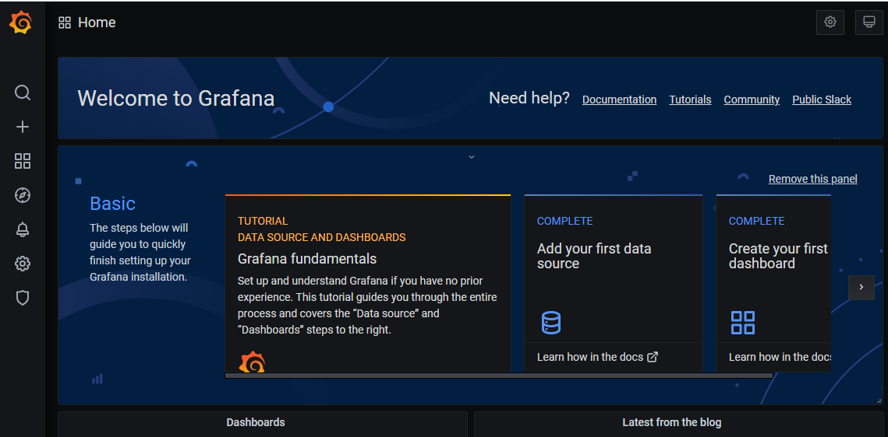


## 7 在Grafana上添加Prometheus数据源
我们把prometheus服务器收集的数据做为一个数据源添加到grafana,让grafana可以得到prometheus的数据
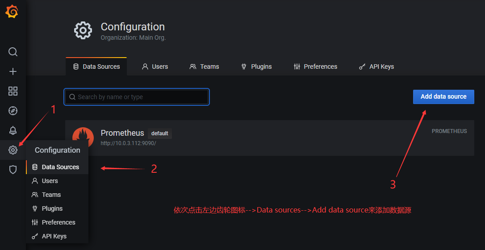
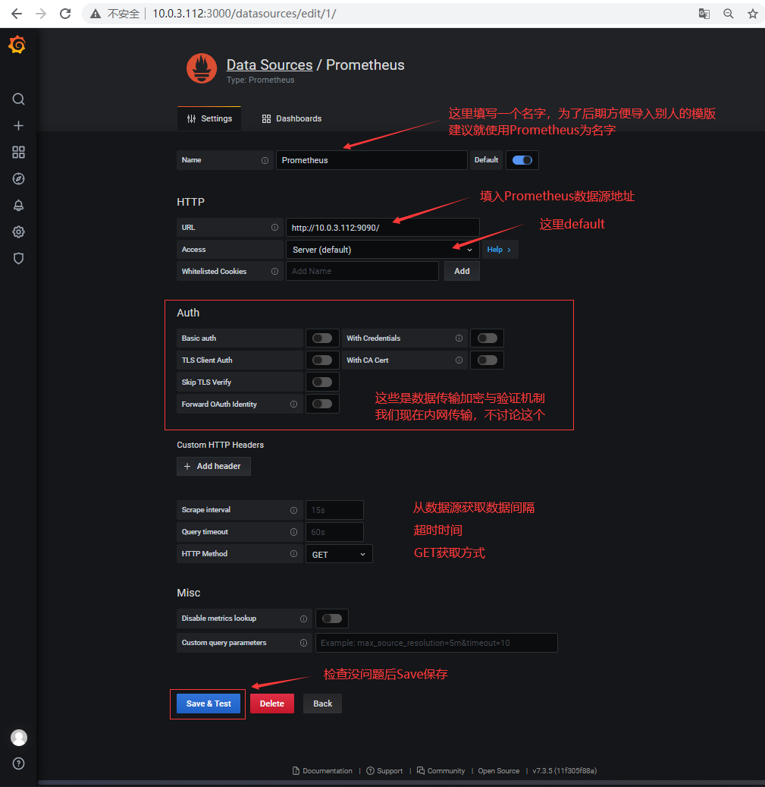
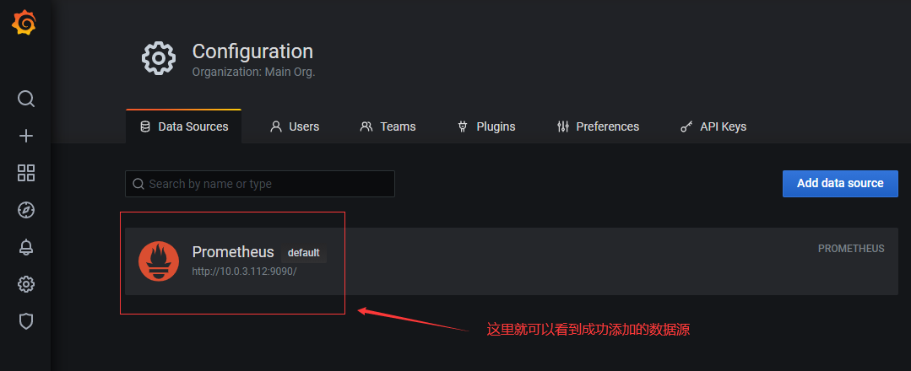

## 8 Grafana图形显示Linux硬件信息
- Grafana官方提供模板地址：https://grafana.com/grafana/dashboards
- 本次要导入的模板：https://grafana.com/grafana/dashboards/11074 **48.9实际使用的是8919模板，没有使用11074**

### 8.1 Grafana导入监控模板
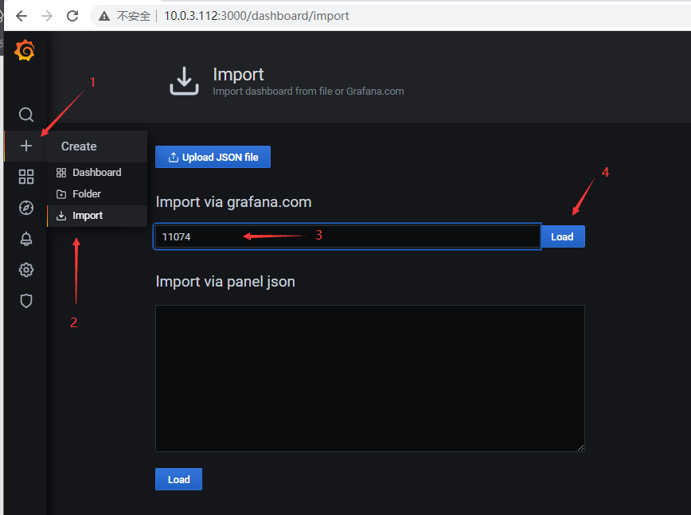
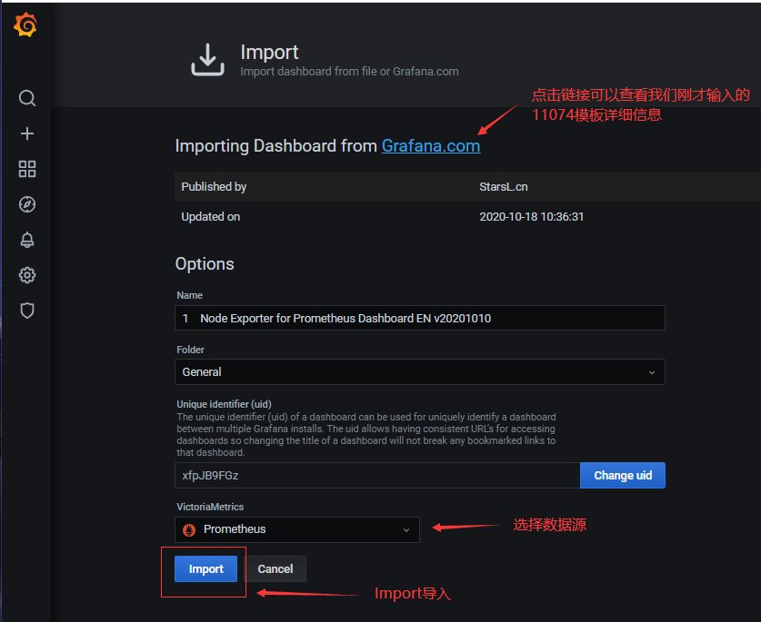

### 8.2 选择导入成功的模板查看
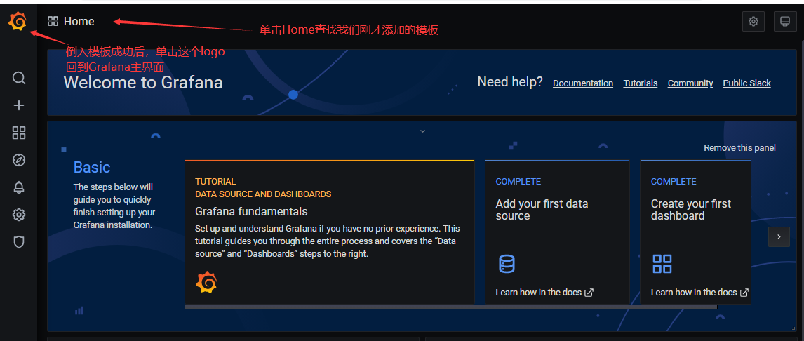
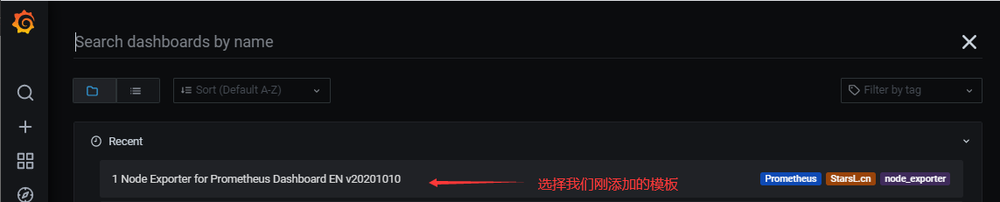

### 8.3 即可看到逼格非常高的系统主机节点监控信息
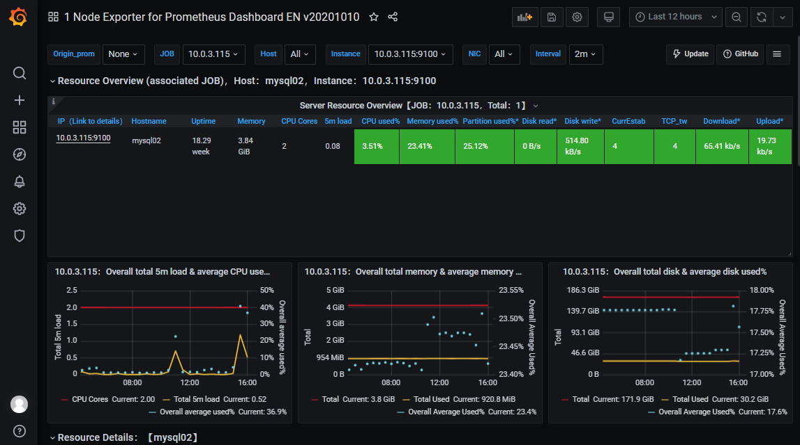
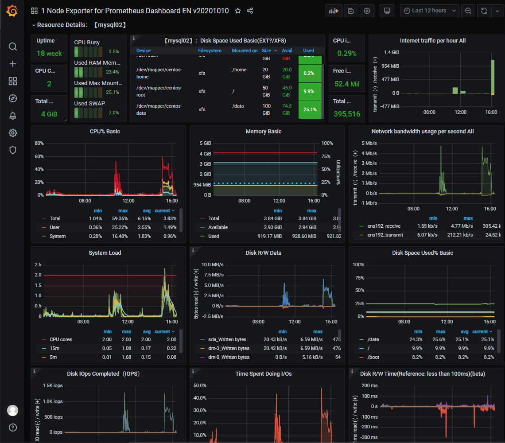


## 9 Grafana图形显示MySQL监控数据
### 9.1 通过Grafana官网导入模板
- MySQL监控做的最好当属percona公司的了
- Grafana官网地址：https://grafana.com/grafana/dashboards/7362

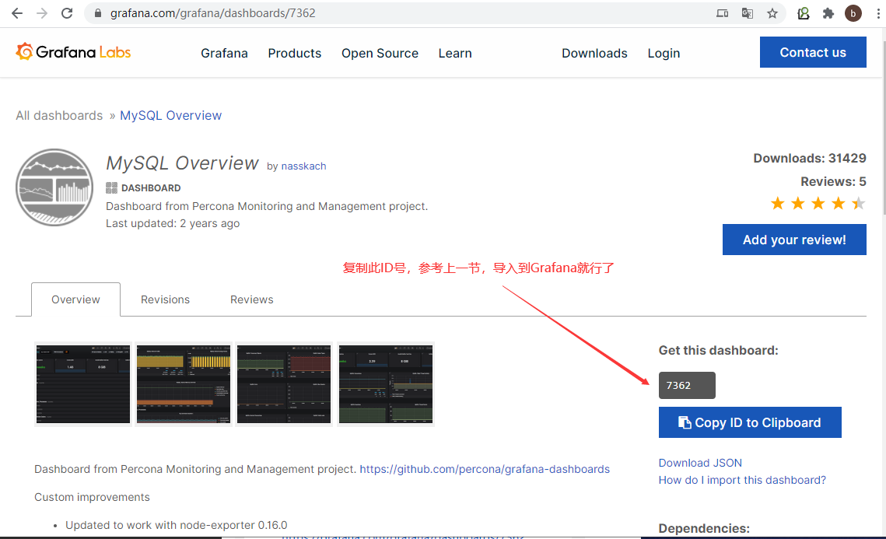

### 9.2 grafana展示MySQL相关数据
没数据可能是需要等一会，让数据传过来。
有些可能是Prometheus没有采集相关指标。
